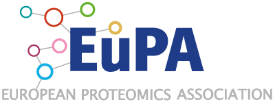

---

layout: home
classes: wide
title: Welcome to the Metaproteomics Initiative!
sidebar:
  - text: '<a class="twitter-timeline" data-lang="en" href="https://twitter.com/MetaP_Init?ref_src=twsrc%5Etfw">Tweets by MetaP_Init</a> '
---

We promote dissemination of metaproteomics fundamentals, advancements, and applications through collaborative networking in microbiome research. We aim to be the central information hub and open meeting place where newcomers and experts interact to communicate, standardize and accelerate experimental and bioinformatic methodologies in this field. This will be achieved initially through this website, presentations, online communication channel, collaborative projects, and symposia. More information can be found in our commentary article in [Microbiome](https://microbiomejournal.biomedcentral.com/articles/10.1186/s40168-021-01176-w).

Since February 2021, we are recognized as an official [EuPA](https://eupa.org/) Initiative.
Want to stay up to date about the metaproteomics field and the Initiative? Become a member by filling in [this form](https://forms.gle/zAqJDPZNvf7vSoNi9). If you can't fill in the Google form because of certain restrictions, please contact us via [info@metaproteomics.org](mailto:info@metaproteomics.org).

Thank you for your interest, 
the Metaproteomics Intitiative

*Contact details: [info@metaproteomics.org](mailto:info@metaproteomics.org)*

{:style="height:400px;"}

{:style="height:150px;"}
{:style="height:150px;"}
